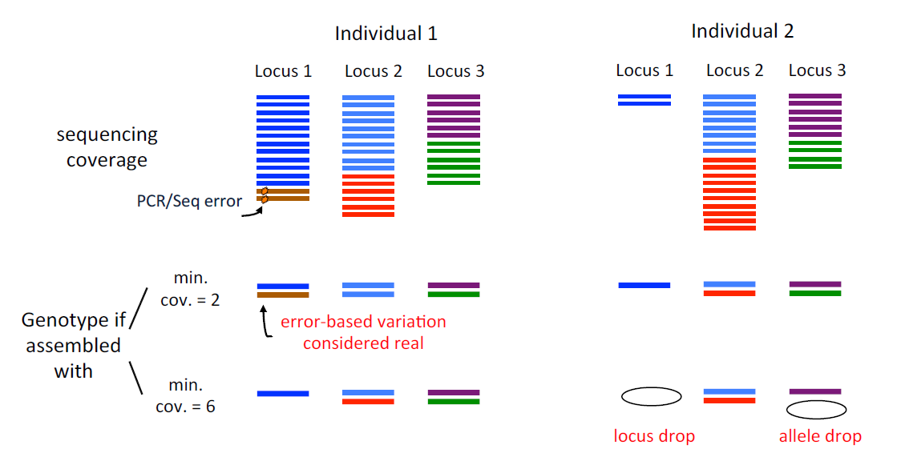

<h2> Optimization of <em>de novo</em> assembly parameters with GBS data</h2>

#### INTRODUCTION
Inferring phylogenetic relationships in recently divergent groups can be a challenge because it can generate complicated genetic patterns (e. g. hybridization/introgression, and incomplete lineage sorting) (Goetze et al., 2017; Li et al., 2016). Massive parallel sequencing offer great potential to efficiently sample complete genomes of any taxon with the intention of finding phylogenetically informative variation (Eaton & Ree, 2013). The use of single nucleotide polymorphisms (SNPs) has been increasing in studies of phylogenetic inference and has been considered an excellent option in non-model species (Leaché and Oaks, 2017). In particular, reduced representation genome sequencing can be a useful tool in phylogenetic inference (Hou et al., 2015). Restriction site-associated DNA sequencing (RADseq) (Miller et al., 2007), has been used to solve problems of introgression (Eaton & Ree 2013) and incomplete lineage sorting (Streicher et al., 2014). Genotyping by sequencing (GBS) (Elshire et al., 2011), is a method that has proven useful for resolving phylogenetic relationships in species complexes (Anderson, Thiele, Krauss, & Barrett, 2017), as well as to evaluate population genetic structure (Otto et al., 2017). However, errors are also present in these types of methods and can be of several types: human, from labeling the samples to contamination; laboratory, the processes in the techniques used can be from a bad enzyme performance, PCR errors, barcode errors, among others; bioinformatics, filtering processes can generate allele drop and loci drop, which can be seen as reflected in an increase in homozygosis. These errors can cause incorrect biological interpretations (Mastretta-Yanes et al., 2015). The important is to take into account these errors and how they can affect our results, some can be detected in the bioinformatic process. There are several programs to analyze data obtained through reduced representation genome sequencing. *Stacks* was created by Catchen et al. (2011) for the identification and genotyping of loci in a group of individuals through a *de novo* assembly or by comparison with a reference genome. Mainly it has been used to perform population genetics analysis and it is where it performs best. *PyRAD* was created by Eaton (2014) to assemble *de novo* loci or with reference genome to optimize coverage through phylogenetic data sets. The main difference between these two programs is that *PyRAD* uses a global alignment grouping algorithm through the *USEARCH* program (Edgar, 2010), which allows the presence of insertions and deletions (indels) making it possible to compare phylogenetically distant species (Pante et al., 2015). *PyRAD* and *Stacks* include several parameters to consider to perform a *de novo* assembly, the optimal values depend on each data set (e. g. taxon, quality in the sequences, etc.). Each program has its parameters, but some are shared. Among the most important parameters is the minimum coverage, which refers to the number of reads needed to consider an allele or locus. This parameter allows distinguishing between a PCR/sequencing error of a real variation. If this value is very low we can accept variation from an error and consider it real, while if we choose a high value we can generate allelic drop and locus drop (Figure 1). If we generate locus drop, we will be generating missing data, but if we allow drop allele, we will be affecting the heterozygosity (Mastretta-Yanes et al., 2015). The level of dissimilarity of the sequences is another parameter that is also important to take into account since it will allow us to filter the paralogous loci. If we choose a very high value, it carries the risk of splitting the divergent alleles into separate loci, while lower similarity thresholds may allow the paralogous sequences to merge incorrectly into an orthologous site (Nadukkalam Ravindran et al., 2018).

Figure 1.- Scheme showing the effects of using a low minimum coverage (= 2) and a high coverage (= 6), taken from Mastretta-Yanes et al. (2015)

Because the level of genetic differentiation between samples depends on many factors, including population structure, effective size, and mutation rate, it is not advisable to perform analyzes in *Stacks* and *PyRAD* with the default parameters (McCartney-Melstad et al., 2017). Mastretta-Yanes et al. (2019) propose to choose the optimal assembly, based on replicates that minimizing the genetic distance and error rates.  When replicated samples are not available, the option is to explore the parameters and choose those that maximize the number of SNPs and loci recovered (Paris et al., 2017). According to McCartney-Melstad et al. (2019), various metrics can be evaluated to find the optimal assemblies among which are the aforementioned metrics, as well as heterozygosis and the percentage of bootstrap values of a maximum likelihood analysis. Recently, PyRAD has now been superseded by ipyrad. Therefore,  the aim of this work is to evaluate two parameters in this program (clustering threshold and mindepth) under the evaluation of five metrics: the number of loci and SNPs recovered, the level of heterozygosis, the genetic distance between samples from the same location and nearby, the fraction of bootstrap supports for maximum likelihood analysis. The resulting analyses will be evaluated to select the optimal assembly. The effect of lost data on phylogenetic resolution and support of nodes is also evaluated, as well as topology under different percentages of missing data.

#### MATERIALS AND METHODS
