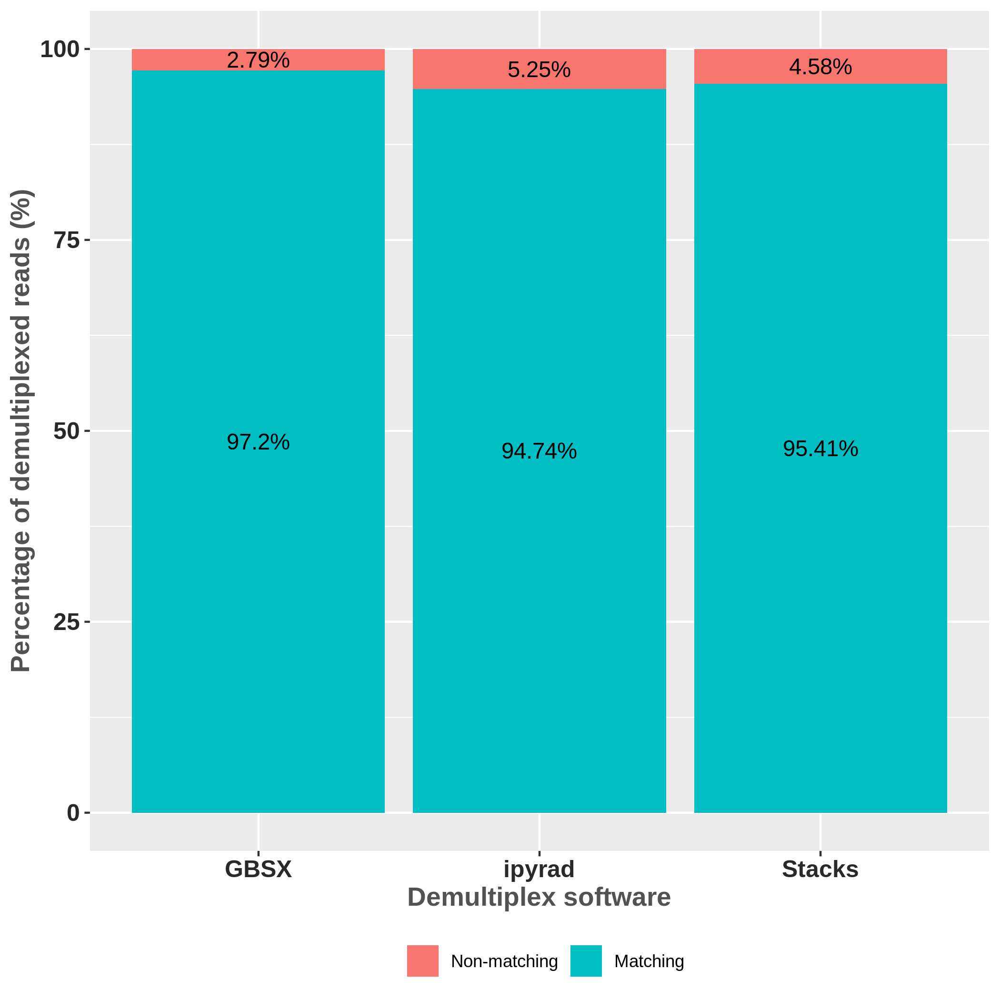
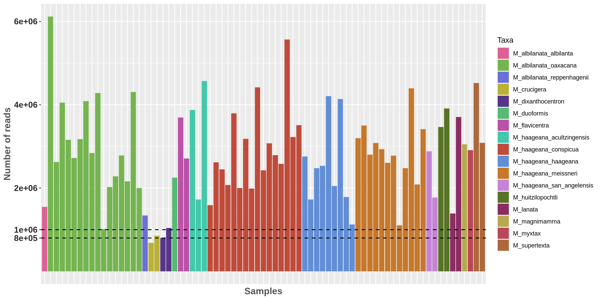

<h2> <strong>  Optimization of <em>de novo</em> assembly from GBS data </strong> </h2>

#### INTRODUCTION
Inferring phylogenetic relationships in recently divergent groups can be a challenge because it can generate complicated genetic patterns (e. g. hybridization/introgression, and incomplete lineage sorting) (Goetze et al., 2017; Li et al., 2016). Massive parallel sequencing offer great potential to efficiently sample complete genomes of any taxon with the intention of finding phylogenetically informative variation (Eaton & Ree, 2013). The use of single nucleotide polymorphisms (SNPs) has been increasing in studies of phylogenetic inference and has been considered an excellent option in non-model species (Leaché and Oaks, 2017). In particular, reduced representation genome sequencing can be a useful tool in phylogenetic inference (Hou et al., 2015). Restriction site-associated DNA sequencing (RADseq) (Miller et al., 2007), has been used to solve problems of introgression (Eaton & Ree 2013) and incomplete lineage sorting (Streicher et al., 2014). Genotyping by sequencing (GBS) (Elshire et al., 2011), is a method that has proven useful for resolving phylogenetic relationships in species complexes (Anderson, Thiele, Krauss, & Barrett, 2017), as well as to evaluate population genetic structure (Otto et al., 2017). However, errors are also present in these types of methods and can be of several types: human, from labeling the samples to contamination; laboratory, the processes in the techniques used can be from a bad enzyme performance, PCR errors, barcode errors, among others; bioinformatics, filtering processes can generate allele drop and loci drop, which can be seen as reflected in an increase in homozygosis. These errors can cause incorrect biological interpretations (Mastretta-Yanes et al., 2015). The important is to take into account these errors and how they can affect our results, some can be detected in the bioinformatic process. There are several programs to analyze data obtained through reduced representation genome sequencing. *Stacks* was created by Catchen et al. (2011) for the identification and genotyping of loci in a group of individuals through a *de novo* assembly or by comparison with a reference genome. Mainly it has been used to perform population genetics analysis and it is where it performs best. *PyRAD* was created by Eaton (2014) to assemble *de novo* loci or with reference genome to optimize coverage through phylogenetic data sets. The main difference between these two programs is that *PyRAD* uses a global alignment grouping algorithm through the *USEARCH* program (Edgar, 2010), which allows the presence of insertions and deletions (indels) making it possible to compare phylogenetically distant species (Pante et al., 2015). *PyRAD* and *Stacks* include several parameters to consider to perform a *de novo* assembly, the optimal values depend on each data set (e. g. taxon, quality in the sequences, etc.). Each program has its parameters, but some are shared. Among the most important parameters is the minimum coverage, which refers to the number of reads needed to consider an allele or locus. This parameter allows distinguishing between a PCR/sequencing error of a real variation. If this value is very low we can accept variation from an error and consider it real, while if we choose a high value we can generate allelic drop and locus drop (Figure 1). If we generate locus drop, we will be generating missing data, but if we allow drop allele, we will be affecting the heterozygosity (Mastretta-Yanes et al., 2015). The level of dissimilarity of the sequences is another parameter that is also important to take into account since it will allow us to filter the paralogous loci. If we choose a very high value, it carries the risk of splitting the divergent alleles into separate loci, while lower similarity thresholds may allow the paralogous sequences to merge incorrectly into an orthologous site (Nadukkalam Ravindran et al., 2018).

Figure 1.- Scheme showing the effects of using a low minimum coverage (= 2) and a high coverage (= 6), taken from Mastretta-Yanes et al. (2015)

Because the level of genetic differentiation between samples depends on many factors, including population structure, effective size, and mutation rate, it is not advisable to perform analyzes in *Stacks* and *PyRAD* with the default parameters (McCartney-Melstad et al., 2017). Mastretta-Yanes et al. (2019) propose to choose the optimal assembly, based on replicates that minimizing the genetic distance and error rates.  When replicated samples are not available, the option is to explore the parameters and choose those that maximize the number of SNPs and loci recovered (Paris et al., 2017). According to McCartney-Melstad et al. (2019), various metrics can be evaluated to find the optimal assemblies among which are the aforementioned metrics, as well as heterozygosis and the percentage of bootstrap values of a maximum likelihood analysis. Recently, *PyRAD* has now been superseded by *ipyrad*. Therefore,  the aim of this work is to evaluate two parameters in this program (clustering threshold and mindepth) under the evaluation of five metrics: the number of loci and SNPs recovered, the level of heterozygosis, the genetic distance between samples from the same location and nearby, the fraction of bootstrap supports for maximum likelihood analysis. The resulting analyses will be evaluated to select the optimal assembly. The effect of lost data on phylogenetic resolution and support of nodes is also evaluated, as well as topology under different percentages of missing data.

#### MATERIALS AND METHODS
##### Selected samples
The majority of the species of series *Supertextae* (7 of 9) recognized by Hunt (2006) were included. *Supertextae* species are diploid (2n = 2x = 22, x = 11) and their genome size varies from 1489 to 1570 Mbp (mean = 1535, sd = 26), in particular *Mammillaria haageana* has a size of 1527 Mbp (Christian et al., 2006). *Mammillaria haageana* represents a complex that extends widely in southern Mexico, in different types of vegetation such as xerophilous scrub, pine-oak forests and secondary vegetation. In the state of Oaxaca, it shares distribution with *M. albilanata* ssp. *Oaxaca*, both taxa are morphologically similar and it has been a problem to establish their taxonomic limits (Arias et al., 2012). Therefore, an exhaustive collection was made during May-October 2017 and June 2018 to cover the distribution of *M. haageana* and *M. albilanata* ssp. *Oaxaca*. In total, 19 locations were visited for *M. haageana* and 7 for *M. albilanata* ssp. *oaxacana* ([Table 1](https://github.com/cristoichkov/GBS_Bioinf_Process_Mamm/blob/master/meta/Mamm_names.csv)), in each locality 5 live plants were collected that were deposited in the Cactaceae collection of the IB-UNAM Botanical Garden. The tissue used for DNA extraction was obtained from the collections made and from the live specimens arranged in the collection for the rest of the taxa. As an external group, three species from three different series were selected: *M. duoformis* (*Polyacanthae*) sister species of *Supertextae*, *M. magnimamma* (*Mammillaria*) and *M. mystax* (*Polyedrae*).

##### Molecular Methods
The DNA was extracted from 0.04g of tissue from the stem and put in silica for 24h. The samples were stored at -80 °C and 12 hours later it was grinder in a TissueLyser II (Qiagen, Venlo, The Netherlands) at 29 rpm for 25 seconds twice. The extraction was carried out with the DNeasy Plant Mini Kit (Qiagen, Hilden, Germany) following the manufacturer's instructions and the elution volume was 2 x 35 µl in milliQ water. Two to three individuals were selected by location, with a total of 75 samples, which were sent to be sequenced at the Biotechnology Center, University of Wisconsin-Madison. The GBS protocol was performed for all samples, the enzymes selected were *Nsil* (5 '... ATGC ▽ T ... 3') and *MspI* (5 '... C ▽ CGG ... 3), and sequencing was pair-end (R1-reverse and R2-forward).

##### Assignment of reads to their corresponding sample (demultiplexing)
It is the process by which sequences are identified by a barcode, which are short sequences of approx. 4-8 bp. During the preparation of the libraries each sample is linked with an adapter and a unique barcode, this allows us to identify and separate the samples from other sequences at the same time. *ipyrad* and *Stacks* have their own algorithms for this purpose; However, there are other programs that allow demultiplexing raw sequences. *GBSX* (Herten et al., 2015) is a program designed primarily to work with GBS data, its performance has exceeded the *Stacks* algorithm (*process_radtags*). The performance of *ipyrad* v.0.7.30 , *Stacks* v2.3e, and *GBSX* v1.3  was evaluated to know which algorithm allows us to recover the greatest number of readings.

##### Workflow to generate de novo assemblies
The *ipyrad* v.0.7.30 workflow consists of 7 steps, the first corresponds to the demultiplexing process, which was omitted since the raw readings obtained with GBSX were chosen. In the second step, the filtering of the sequences is carried out, since the sequences are pairgbs strict filtering of adapters was made (= 2), a cut was also applied on all the readings eliminating the first 10 bp and from position 130 since a low quality was observed. Step 3 records the number of times each unique reading is observed.  If the data are paired-end, it then uses *vsearch* to merge paired reads which overlap. The resulting data is grouped *de novo*, the reads are combined according to the sequence similarity and the resulting groups are aligned using the *muscle* algorithm (Edgar, 2004). In steps 4 and 5, the sequencing error rate and heterozygosity are calculated together based on the site pattern counts in the clustered reads. A diploid model is used (that is, two alleles are expected to occur equally). During this step, the maximum number of undetermined sites (Ns) per locus (max_Ns_consens) is also filtered. The number of alleles in each locus is recorded and the reading depth information is also stored. Step 6 clustering the consensus sequences in all samples using the same assembly method as in step 3. An allele is randomly sampled before clustering, so that ambiguous characters have a lesser effect on the cluster. The clustered sequences are then aligned using *muscle* again. In step 7, the filters are applied to the final alignments and the data is saved in various output formats (phylip, nexus, genotype, and structure). Assemblies were made testing different values of minimum coverage (*mindepth_statistical*) and similarity thresholds (*clust_threshold*) (Table 2).  

| Parameter                  |Step   |default value|          Values to test       |
|----------------------------|:-----:|:-----------:|:-----------------------------:|
| <em>mindepth</em>          |4 and 5|     6       |              3 to 12          |
|  <em>clust_threshold</em>  |3 and 6|    0.90     |0.82, 0.85 to 0.89, 0.91, 0.94 |

Table 2. <em> ipyrad</em> parameters that were tested in different combinations.

#### RESULTS
The results show that *GBSX* recovered the highest number of reads (97.2%), followed by *Stacks* (95.41%), while ipyrad recovered the lowest number (94.74%) (Figure 2). The readings were assigned to each sample according to their barcode, the number of reads per sample ranged from 684,453 to 6,118,488 (mean = 2,798,302, sd = 1,108,075) (Figure 3; [Table 3](https://github.com/cristoichkov/GBS_Bioinf_Process_Mamm/blob/master/out/demultiplex_stats/stats_summary_demultiplex_filter.csv)). A filter was applied to remove samples with less than 800,000 readings and only one sample corresponding to M. crucigera was removed. After filtering during step two of ipyrad, the percentage of readings that passed the filters was 76% to 90.63% (mean = 84.81%, sd = 2.73%).

Figure 2.- Scheme showing the effects of using a low minimum coverage (= 2) and a high coverage (= 6), taken from Mastretta-Yanes et al. (2015)

Figure 3.- Scheme showing the effects of using a low minimum coverage (= 2) and a high coverage (= 6), taken from Mastretta-Yanes et al. (2015)

