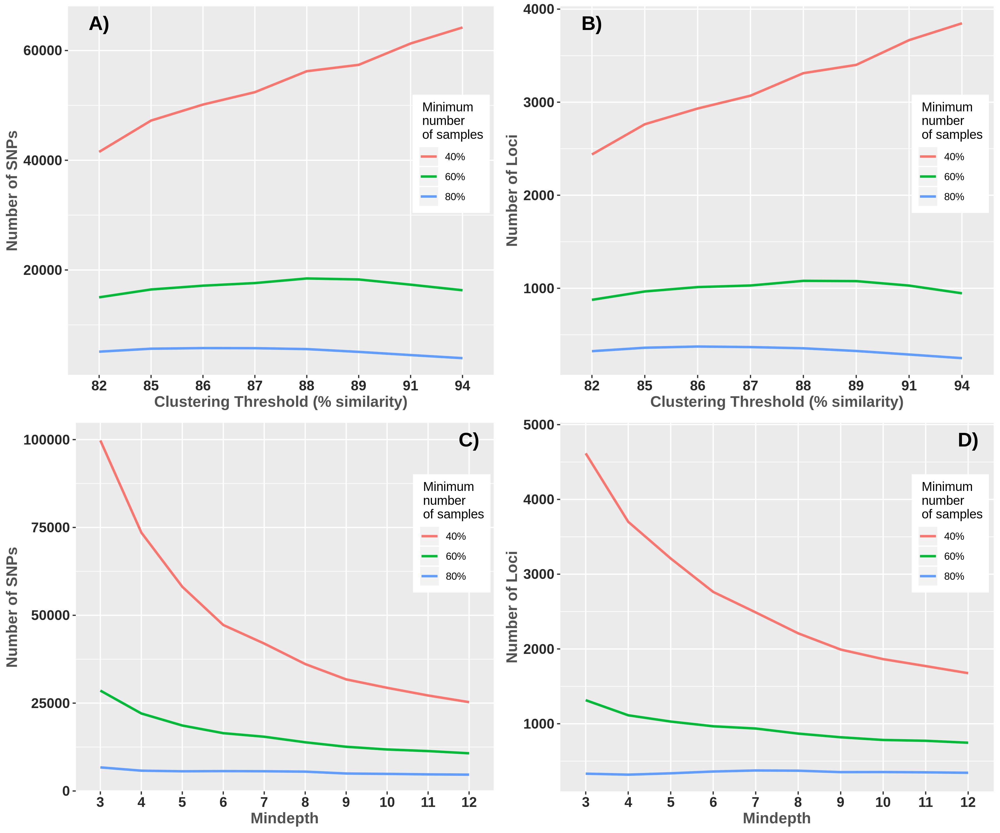
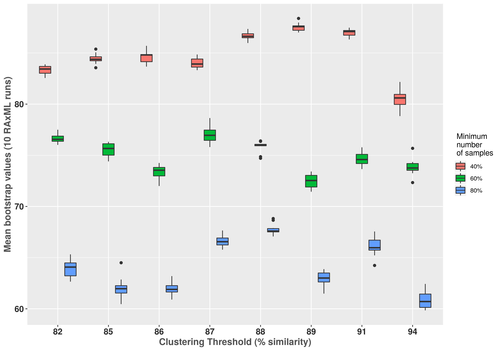

<h2> <strong>  Optimization of <em>de novo</em> assembly from GBS data </strong> </h2>

#### INTRODUCTION
Inferring phylogenetic relationships in recently divergent groups can be a challenge because it can generate complicated genetic patterns (e. g. hybridization/introgression, and incomplete lineage sorting) (Goetze et al., 2017; Li et al., 2016). Massive parallel sequencing offer great potential to efficiently sample complete genomes of any taxon with the intention of finding phylogenetically informative variation (Eaton & Ree, 2013). The use of single nucleotide polymorphisms (SNPs) has been increasing in studies of phylogenetic inference and has been considered an excellent option in non-model species (Leaché and Oaks, 2017). In particular, reduced representation genome sequencing can be a useful tool in phylogenetic inference (Hou et al., 2015). Restriction site-associated DNA sequencing (RADseq) (Miller et al., 2007), has been used to solve problems of introgression (Eaton & Ree 2013) and incomplete lineage sorting (Streicher et al., 2014). Genotyping by sequencing (GBS) (Elshire et al., 2011), is a method that has proven useful for resolving phylogenetic relationships in species complexes (Anderson, Thiele, Krauss, & Barrett, 2017), as well as to evaluate population genetic structure (Otto et al., 2017). However, errors are also present in these types of methods and can be of several types: human, from labeling the samples to contamination; laboratory, the processes in the techniques used can be from a bad enzyme performance, PCR errors, barcode errors, among others; bioinformatics, filtering processes can generate allele drop and loci drop, which can be seen as reflected in an increase in homozygosis. These errors can cause incorrect biological interpretations (Mastretta-Yanes et al., 2015). The important is to take into account these errors and how they can affect our results, some can be detected in the bioinformatic process. There are several programs to analyze data obtained through reduced representation genome sequencing. *Stacks* was created by Catchen et al. (2011) for the identification and genotyping of loci in a group of individuals through a *de novo* assembly or by comparison with a reference genome. Mainly it has been used to perform population genetics analysis and it is where it performs best. *PyRAD* was created by Eaton (2014) to assemble *de novo* loci or with reference genome to optimize coverage through phylogenetic data sets. The main difference between these two programs is that *PyRAD* uses a global alignment grouping algorithm through the *USEARCH* program (Edgar, 2010), which allows the presence of insertions and deletions (indels) making it possible to compare phylogenetically distant species (Pante et al., 2015). *PyRAD* and *Stacks* include several parameters to consider to perform a *de novo* assembly, the optimal values depend on each data set (e. g. taxon, quality in the sequences, etc.). Each program has its parameters, but some are shared. Among the most important parameters is the minimum coverage, which refers to the number of reads needed to consider an allele or locus. This parameter allows distinguishing between a PCR/sequencing error of a real variation. If this value is very low we can accept variation from an error and consider it real, while if we choose a high value we can generate allelic drop and locus drop (Figure 1). If we generate locus drop, we will be generating missing data, but if we allow drop allele, we will be affecting the heterozygosity (Mastretta-Yanes et al., 2015). The level of dissimilarity of the sequences is another parameter that is also important to take into account since it will allow us to filter the paralogous loci. If we choose a very high value, it carries the risk of splitting the divergent alleles into separate loci, while lower similarity thresholds may allow the paralogous sequences to merge incorrectly into an orthologous site (Nadukkalam Ravindran et al., 2018).

Figure 1.- Scheme showing the effects of using a low minimum coverage (= 2) and a high coverage (= 6), taken from Mastretta-Yanes et al. (2015)

Because the level of genetic differentiation between samples depends on many factors, including population structure, effective size, and mutation rate, it is not advisable to perform analyzes in *Stacks* and *PyRAD* with the default parameters (McCartney-Melstad et al., 2017). Mastretta-Yanes et al. (2019) propose to choose the optimal assembly, based on replicates that minimizing the genetic distance and error rates.  When replicated samples are not available, the option is to explore the parameters and choose those that maximize the number of SNPs and loci recovered (Paris et al., 2017). According to McCartney-Melstad et al. (2019), various metrics can be evaluated to find the optimal assemblies among which are the aforementioned metrics, as well as heterozygosis and the percentage of bootstrap values of a maximum likelihood analysis. Recently, *PyRAD* has now been superseded by *ipyrad*. Therefore,  the aim of this work is to evaluate two parameters in this program (clustering threshold and mindepth) under the evaluation of five metrics: the number of loci and SNPs recovered, the level of heterozygosis, the genetic distance between samples from the same location and nearby, the fraction of bootstrap supports for maximum likelihood analysis. The resulting analyses will be evaluated to select the optimal assembly. The effect of lost data on phylogenetic resolution and support of nodes is also evaluated, as well as topology under different percentages of missing data.

#### MATERIALS AND METHODS
##### Selected samples
The majority of the species of series *Supertextae* (7 of 9) recognized by Hunt (2006) were included. *Supertextae* species are diploid (2n = 2x = 22, x = 11) and their genome size varies from 1489 to 1570 Mbp (mean = 1535, sd = 26), in particular *Mammillaria haageana* has a size of 1527 Mbp (Christian et al., 2006). *Mammillaria haageana* represents a complex that extends widely in southern Mexico, in different types of vegetation such as xerophilous scrub, pine-oak forests and secondary vegetation. In the state of Oaxaca, it shares distribution with *M. albilanata* ssp. *Oaxaca*, both taxa are morphologically similar and it has been a problem to establish their taxonomic limits (Arias et al., 2012). Therefore, an exhaustive collection was made during May-October 2017 and June 2018 to cover the distribution of *M. haageana* and *M. albilanata* ssp. *Oaxaca*. In total, 19 locations were visited for *M. haageana* and 7 for *M. albilanata* ssp. *oaxacana* ([Table 1](https://github.com/cristoichkov/GBS_Bioinf_Process_Mamm/blob/master/meta/Mamm_names.csv)), in each locality 5 live plants were collected that were deposited in the Cactaceae collection of the IB-UNAM Botanical Garden. The tissue used for DNA extraction was obtained from the collections made and from the live specimens arranged in the collection for the rest of the taxa. As an external group, three species from three different series were selected: *M. duoformis* (*Polyacanthae*) sister species of *Supertextae*, *M. magnimamma* (*Mammillaria*) and *M. mystax* (*Polyedrae*).

##### Molecular Methods
The DNA was extracted from 0.04g of tissue from the stem and put in silica for 24h. The samples were stored at -80 °C and 12 hours later it was grinder in a TissueLyser II (Qiagen, Venlo, The Netherlands) at 29 rpm for 25 seconds twice. The extraction was carried out with the DNeasy Plant Mini Kit (Qiagen, Hilden, Germany) following the manufacturer's instructions and the elution volume was 2 x 35 µl in milliQ water. Two to three individuals were selected by location, with a total of 75 samples, which were sent to be sequenced at the Biotechnology Center, University of Wisconsin-Madison. The GBS protocol was performed for all samples, the enzymes selected were *Nsil* (5 '... ATGC ▽ T ... 3') and *MspI* (5 '... C ▽ CGG ... 3), and sequencing was pair-end (R1-reverse and R2-forward).

##### Assignment of reads to their corresponding sample (demultiplexing)
It is the process by which sequences are identified by a barcode, which are short sequences of approx. 4-8 bp. During the preparation of the libraries each sample is linked with an adapter and a unique barcode, this allows us to identify and separate the samples from other sequences at the same time. *ipyrad* and *Stacks* have their own algorithms for this purpose; However, there are other programs that allow demultiplexing raw sequences. *GBSX* (Herten et al., 2015) is a program designed primarily to work with GBS data, its performance has exceeded the *Stacks* algorithm (*process_radtags*). The performance of *ipyrad* v.0.7.30 , *Stacks* v2.3e, and *GBSX* v1.3  was evaluated to know which algorithm allows us to recover the greatest number of readings.

##### Workflow to generate de novo assemblies
The *ipyrad* v.0.7.30 workflow consists of 7 steps, the first corresponds to the demultiplexing process, which was omitted since the raw readings obtained with GBSX were chosen. In the second step, the filtering of the sequences is carried out, since the sequences are pairgbs strict filtering of adapters was made (= 2), a cut was also applied on all the readings eliminating the first 10 bp and from position 130 since a low quality was observed. Step 3 records the number of times each unique reading is observed.  If the data are paired-end, it then uses *vsearch* to merge paired reads which overlap. The resulting data is grouped *de novo*, the reads are combined according to the sequence similarity and the resulting groups are aligned using the *muscle* algorithm (Edgar, 2004). In steps 4 and 5, the sequencing error rate and heterozygosity are calculated together based on the site pattern counts in the clustered reads. A diploid model is used (that is, two alleles are expected to occur equally). During this step, the maximum number of undetermined sites (Ns) per locus (max_Ns_consens) is also filtered. The number of alleles in each locus is recorded and the reading depth information is also stored. Step 6 clustering the consensus sequences in all samples using the same assembly method as in step 3. An allele is randomly sampled before clustering, so that ambiguous characters have a lesser effect on the cluster. The clustered sequences are then aligned using *muscle* again. In step 7, the filters are applied to the final alignments and the data is saved in various output formats (phylip, nexus, genotype, and structure). Assemblies were made testing different values of minimum coverage (*mindepth_statistical*) and similarity thresholds (*clust_threshold*) (Table 2). To analyze the results obtained during parameter optimization, we created scripts to analyze the five metrics. The workflow and scripts are available at https://github.com/cristoichkov/GBS_Bioinf_Process_Mamm, where you can find information about each program used.

| Parameter                  |Step   |default value|          Values to test       |
|----------------------------|:-----:|:-----------:|:-----------------------------:|
| <em>mindepth</em>          |4 and 5|     6       |              3 to 12          |
|  <em>clust_threshold</em>  |3 and 6|    0.90     |0.82, 0.85 to 0.89, 0.91, 0.94 |

Table 2. <em> ipyrad</em> parameters that were tested in different combinations.

##### Phylogenetic Resolution
To test the impact of the missing data on the phylogenetic resolution, nodes support, and the tree topology, the assembly with a clustering threshold of 0.89 and a mindepth of 9 was used, which was selected with the preliminary results previous. Five matrices with 0%, 20%, 40%, 60% and 80% of lost data were created. A maximum likelihood analysis was performed with *raxml* v8.2.11 (Stamatakis, 2014), which was run 10 times with different parsimony and bootstrap seeds for each data matrix, the GTRGAMMA model was used together with 100 rapid bootstrap replicates. The scripts to analyze the results are available in the aforementioned GitHub repository.

#### RESULTS
The results show that *GBSX* recovered the highest number of reads (97.2%), followed by *Stacks* (95.41%), while ipyrad recovered the lowest number (94.74%) (Figure 2). The readings were assigned to each sample according to their barcode, the number of reads per sample ranged from 684,453 to 6,118,488 (mean = 2,798,302, sd = 1,108,075) (Figure 3; [Table 3](https://github.com/cristoichkov/GBS_Bioinf_Process_Mamm/blob/master/out/demultiplex_stats/stats_summary_demultiplex_filter.csv)). A filter was applied to remove samples with less than 800,000 readings and only one sample corresponding to M. crucigera was removed. After filtering during step two of ipyrad, the percentage of readings that passed the filters was 76% to 90.63% (mean = 84.81%, sd = 2.73%).

Figure 2.- Percentage of correctly assigned and unassigned readings, using three programs to demultiplex.

Figure 3.- Numbers of reads per sample are ordered by taxon which corresponds to a different color.

##### Total number of loci and SNPs recovered using different parameters

During the clustering of step 3, *ipyrad* will allow us to filter the paralogous loci, if we choose a high value it can divide the divergent alleles into separate loci, while the low thresholds can cause the paralogous sequences to merge incorrectly in an orthologous place. The total of polymorphic sites and loci recovered in increments in 0.82, in the case of a minimum of 40% samples the increase is indefinite. While in a minimum of 60% and 80% samples the increase is up to 0.88 and 0.86 respectively, then there is a slow decrease to 0.94 (Figure 4A,B; [Table 4](https://github.com/cristoichkov/GBS_Bioinf_Process_Mamm/blob/master/out/ipyrad_outfiles/stats/stats_params_all.csv)). In the case of the mindepth, the pattern was almost inverse. The total of polymorphic sites and loci recovered decreases from 3, for a minimum of 40% and 60% samples an intense decrease is observed until approximately 9 where it seems to stabilize, this may indicate that there are many unique reads which can be caused for PCR or sequencing errors. While in a minimum of 80% samples it seems to be stable in all the thresholds analyzed (Figure 4C,D;  [Table 4](https://github.com/cristoichkov/GBS_Bioinf_Process_Mamm/blob/master/out/ipyrad_outfiles/stats/stats_params_all.csv)).

Figure 4.- Total SNPs and loci recovered across different (A and B) clustering thresholds and (C and D) mindept. Each color line represents the minimum number of samples that must have data at a given locus for it to be retained in the final data set.

##### Level of heterozygosis affected by different parameters
The level of heterozygosis in the clustering threshold increases from 0.82 to 0.89, where a higher percentage of heterozygosis is observed, this pattern is maintained until 0.91 and subsequently decreases steeply at 0.94 (Figure 5A). For mindepth, the level of heterozygosis was increased slightly to 10 where it seems to stabilize (Figure 5B). Choosing the values with the highest level of heterozygosis assures us that we are not generating allele drop, which would artificially inflate the homozygosis.

Figure 5.- Heterozygous sites percentage across different (A) clustering thresholds and (B) mindept.

##### Effect of parameters on genetic distance
The genetic distances of 10 putative populations (samples from the same location and close to it) were compared to find the parameters that generate the least distance between individuals. The results for the clustering threshold show that the value of 0.91 is the one that generally produces the shortest distances, while more lax values generate the greatest distances (Figure 6). In the mindepth, the pattern is that at a value of 3 the distance is greater and decreases as the depth value increases. The depths where the smallest genetic distances are generated is 10 and remains more or less constant up to 12 (Figure 7).

Figure 6.- Effect of different clustering thresholds on the genetic distance between individuals of the same sampling location and nearby.

Figure 7.- Effect of different mindepth on the genetic distance between individuals of the same sampling location and nearby.

##### Relationship between lost data and different parameters
Reduced representation genome sequencing uses restriction enzymes to generate random cuts on a genome. The more phylogenetically further away is the problem taxa, possibly they will present mutations in the enzyme's cutting regions, which causes missing data in the analyzes. Another source that generates missing data is through the locus loss due to the mindepth, it is expected that at a lower depth more missing data will be generated and decrease as the depth is increased. For the clustering threshold, for both 40% and 60% minimum samples, the pattern is to increase the missing data as this parameter is increased. While for a minimum of 80% samples the pattern seems similar, however, it decreases to 0.91 and increases again to 0.94 (Figure 8). The minimum depth has an inverse pattern while increasing this parameter the levels of lost data decrease. In minimum samples of 40% and 60%, the values ​​seem to stabilize from 10, while at 80% the values ​​are more stable (Figure 9).

Figure 8.- Effect of different clustering thresholds on missing data. Each color represents the minimum number of samples that must have data at a given locus for it to be retained in the final data set.

Figure 9.- Effect of different mindepth on missing data. Each color represents the minimum number of samples that must have data at a given locus for it to be retained in the final data set.

##### Impact of lost data on topology and phylogenetic resolution
There has been much discussion about the impact of missing data on topology and phylogenetic resolution, studies have shown that for both parsimony and probabilistic methods a high percentage of missing data may not have significant effects on the topology, and on the contrary, they may increase the resolution of the nodes. For this analysis, a near-optimal assembly was used (clust_threshold = 0.89, mindepth = 9) and maximum likelihood analysis was generated using matrices with 80%, 60%, 40%, 20% and 0% of missing data. The analyzes showed that when increasing the missing data the resolution (Figure 10) and the support of the nodes was greater (Figure 11). Since bootstrap supports tend to increase as the data increases, it is necessary to make a comparison in the topology to make sure that the inclusion of more data by allowing more missing data does not affect it. Therefore, a comparison was made in the topology between the tree with 80% data and the rest (Figure 12).

Figure 10.- Variation among tree topologies and resolution as a function of the missing data. A) 0%, B) 20%, C) 40%, D) 60% and E) 80% of missing data.

Figure 11.- *raxml* bootstrap values for analyses on the full data matrix at different clustering thresholds. Each color represents the minimum number of samples that must have data at a given locus for it to be retained in the final data set.

Figure 12.- Effect of the missing data on trees topology. The comparison is between 80% of missing data vs A) 60%, B) 40%, C) 20% and D) 0%. In total, 15 putative clades were selected to be used in the comparison.  

#### DISCUSSION
Studied has been carried out demonstrating the importance of optimizing the parameters using special programs to analyze reduced genome representation data such as Stacks (Mastretta-Yanes et al., 2015; Paris et al., 2017) and ipyrad (Tripp et al ., 2017; McCartney-Melstad et al., 2019). In particular, ipyrad has been used mainly to solve phylogenetic relationships in taxonomic complexes (Massatti et al., 2016; Tripp et al., 2017; Fabritzek and Kadereit, 2018; Wagner et al., 2018), since it allows the presence of insertions and deletions (indels) making it possible to compare phylogenetically distant species (Pante et al., 2015). The parameter with the greatest relevance within ipyrad is the grouping threshold, which will allow for a sequence similarity threshold to identify putative orthologous loci. Choosing high similarity thresholds can result in dividing putative orthologous loci and thus eliminate potentially informative variation (Valencia et al., 2018). While lower similarity thresholds may allow paralogous sequences to be merged incorrectly in an orthologous location (Nadukkalam Ravindran et al., 2018). Another parameter of importance is the minimum coverage, the laxer the threshold, the more likely that PCR or sequencing errors are taken as allelic variation, while if we choose a high value we can generate allelic drop and locus drop (Mastretta-Yanes et al., 2015).
Evaluating different metrics allowed us to optimize the two parameters analyzed in ipyrad, differences between metrics were presented making it a bit difficult to choose the optimal assembly (McCartney-Melstad et al., 2019). For the clustering threshold there is more variation between the metrics: the recovery of the number of SNPs and loci, indicating that the optimal ones are between 0.86 and 0.88; heterozygosis, between 0.89 and 0.91; genetic distance, 0.91 in most putative populations; the lost data, between 0.88 and 0.91. While the mindepth was more constant among the metrics, the value is 10 where the majority reached for each of these. Therefore, the optimal clustering threshold was set at 0.91 mainly because it is more constant between the metrics and the mindepth at 10.
Given the nature of reduced representation genome sequencing, including phylogenetically distant taxa increases the possibility that enzyme's cut sites are mutated, which can cause a considerable number of lost data (Huang and Knowles, 2016). Another source that generates lost data is the mindepth, high values ​​can generate a locus drop that is reflected in a greater number of  (Mastretta-Yanes et al., 2015). For these reasons, it is inevitable not to have results with a large amount of missing data, and generally when we are left with matrices without or with a small percentage of lost data, we can assume that these are very conserved sites that do not present the variation necessary to generate phylogenetic resolutions (Tripp et al., 2017). Several studies have evaluated, through real and simulated data, how missing data can affect phylogenetic analyzes. The results have shown that most of the results the topologies are consistent and the supports of the nodes are high (Wiens and Morrill, 2011). With RADseq data, Tripp et al. (2017) showed that with a percentage of 90% of missing data, relations in *Petalidium* were resolved. Our data shows the same pattern for missing data, allows greater phylogenetic resolution and increases the supports of the nodes. Another important point is that the topology is maintained by decreasing lost data, however, the tree without missing data was not resolved and its nodes lack supports, which shows that they are highly conserved regions.

#### CONCLUSION
The importance of performing optimization of parameters in *ipyrad* (clustering threshold and minimum depth) was shown, which demonstrates that lax values in both parameters can lead to the inclusion of PCR or sequencing errors and the addition of paralogical loci in orthologous loci. While very high values can cause allele drop and locus drop, as well as the division of potentially orthologous genes. It is also shown that generating phylogenetic trees with a high percentage of missing data is greater phylogenetic resolution and the supports of the nodes are increased.

#### REFERENCES
* Arias, S., Guzmán-López, L., Guzmán-Cruz, U., & Vázquez-Benítez, B. (2012). Cactaceae. En Flora del Valle de Tehuacán-Cuicatlán 95 (p. 235). México D. F.: Universidad Nacional Autónoma de México.

* Catchen, J. M., Amores, A., Hohenlohe, P., Cresko, W., & Postlethwait, J. H. (2011). Stacks: Building and Genotyping Loci De Novo From Short-Read Sequences. G3: Genes, Genomes, Genetics, 1(3), 171-182. https://doi.org/10.1534/g3.111.000240

* Christian, D. A., Palomino, G., García, A., & Méndez, I. (2006). Nuclear genome size and karyotype analysis in Mammillaria species (Cactaceae). Caryologia, 59(2), 177-186. https://doi.org/10.1080/00087114.2006.10797914

* Eaton, D. A. R. (2014). PyRAD: assembly of de novo RADseq loci for phylogenetic analyses. Bioinformatics, 30(13), 1844-1849. https://doi.org/10.1093/bioinformatics/btu121

* Eaton, D. A. R. (2019). ipyrad. Recuperado 21 de mayo de 2019, de https://ipyrad.readthedocs.io/files.html

* Eaton, D. A. R., & Ree, R. H. (2013). Inferring Phylogeny and Introgression using RADseq Data: An Example from Flowering Plants (Pedicularis: Orobanchaceae). Systematic Biology, 62(5), 689-706. https://doi.org/10.1093/sysbio/syt032

* Edgar, R. C. (2004). MUSCLE: multiple sequence alignment with high accuracy and high throughput. Nucleic Acids Research, 32(5), 1792-1797.

* Edgar, Robert C. (2010). Search and clustering orders of magnitude faster than BLAST. Bioinformatics (Oxford, England), 26(19), 2460-2461. https://doi.org/10.1093/bioinformatics/btq461

* Fabritzek, A. G., & Kadereit, J. W. (2018). Identity and relationships of Sempervivum tectorum (Crassulaceae) in the Rhine Gorge area. Willdenowia, 48(3), 405-414. https://doi.org/10.3372/wi.48.48310

* Goetze, M., Zanella, C. M., Palma‐Silva, C., Büttow, M. V., & Bered, F. (2017). Incomplete lineage sorting and hybridization in the evolutionary history of closely related, endemic yellow-flowered Aechmea species of subgenus Ortgiesia (Bromeliaceae). American Journal of Botany, 104(7), 1073-1087. https://doi.org/10.3732/ajb.1700103

* Guzmán, U., Arias, S., & Dávila, P. (2003). Catálogo de cactáceas mexicanas. México, D.F.: Universidad Nacional Autónoma de México/Comisión Nacional para el Conocimiento y Uso de la Biodiversidad.

* Huang, H., & Knowles, L. L. (2016). Unforeseen Consequences of Excluding Missing Data from Next-Generation Sequences: Simulation Study of RAD Sequences. Systematic Biology, 65(3), 357-365. https://doi.org/10.1093/sysbio/syu046

* Hunt, D. R. (2006). The new cactus lexicon. The Manse Chapel Lane Milbourne Port: DH Books.
Li, Q.-Q., Zhou, S.-D., Huang, D.-Q., He, X.-J., & Wei, X.-Q. (2016). Molecular phylogeny, divergence time estimates and historical biogeography within one of the world’s largest monocot genera. AoB PLANTS, 8. https://doi.org/10.1093/aobpla/plw041

* Massatti, R., Reznicek, A. A., & Knowles, L. L. (2016). Utilizing RADseq data for phylogenetic analysis of challenging taxonomic groups: A case study in Carex sect. Racemosae. American Journal of Botany, 103(2), 1-11.

* Mastretta‐Yanes, A., Arrigo, N., Alvarez, N., Jorgensen, T. H., Piñero, D., & Emerson, B. C. (2015). Restriction site-associated DNA sequencing, genotyping error estimation and de novo assembly optimization for population genetic inference. Molecular Ecology Resources, 15(1), 28-41. https://doi.org/10.1111/1755-0998.12291

* McCartney‐Melstad, E., Gidiş, M., & Shaffer, H. B. (2019). An empirical pipeline for choosing the optimal clustering threshold in RADseq studies. Molecular Ecology Resources, 19(5), 1195-1204. https://doi.org/10.1111/1755-0998.13029

* Nadukkalam Ravindran, P., Bentzen, P., Bradbury, I. R., & Beiko, R. G. (2018). PMERGE: Computational filtering of paralogous sequences from RAD‐seq data. Ecology and Evolution, 8(14), 7002-7013. https://doi.org/10.1002/ece3.4219

* Pante, E., Abdelkrim, J., Viricel, A., Gey, D., France, S. C., Boisselier, M. C., & Samadi, S. (2015). Use of RAD sequencing for delimiting species. Heredity, 114(5), 450-459. https://doi.org/10.1038/hdy.2014.105

* Paris, J. R., Stevens, J. R., & Catchen, J. M. (2017). Lost in parameter space: a road map for stacks. Methods in Ecology and Evolution, 8(10), 1360-1373. https://doi.org/10.1111/2041-210X.12775

* Pilbeam, J. (1999). Mammillaria. Cirio Publishing Services Ltd in Southampton.

* Reppenhagen, W. (1992). Die Gattung Mammillaria. Monographie.

* Stamatakis, A. (2014). raxml version 8: A tool for phylogenetic analysis and post‐analysis of large phylogenies. Bioinformatics, 30( 9), 1312– 1313. https://doi.org/10.1093/bioinformatics/btu033

* Tripp, E. A., Tsai, Y.-H. E., Zhuang, Y., & Dexter, K. G. (2017). RADseq dataset with 90% missing data fully resolves recent radiation of Petalidium (Acanthaceae) in the ultra-arid deserts of Namibia. Ecology and Evolution, 7(19), 7920-7936. https://doi.org/10.1002/ece3.327

* Valencia, L. M., Martins, A., Ortiz, E. M., & Fiore, A. D. (2018). A RAD-sequencing approach to genome-wide marker discovery, genotyping, and phylogenetic inference in a diverse radiation of primates. PLOS ONE, 13(8), e0201254. https://doi.org/10.1371/journal.pone.0201254

* Wagner, N. D., Gramlich, S., & Hörandl, E. (2018). RAD sequencing resolved phylogenetic relationships in European shrub willows (Salix L. subg. Chamaetia and subg. Vetrix) and revealed multiple evolution of dwarf shrubs. Ecology and Evolution, 8(16), 8243-8255. https://doi.org/10.1002/ece3.4360

* Wiens, J. J., & Morrill, M. C. (2011). Missing Data in Phylogenetic Analysis: Reconciling Results from Simulations and Empirical Data. Systematic Biology, 60(5), 719-731. https://doi.org/10.1093/sysbio/syr025
