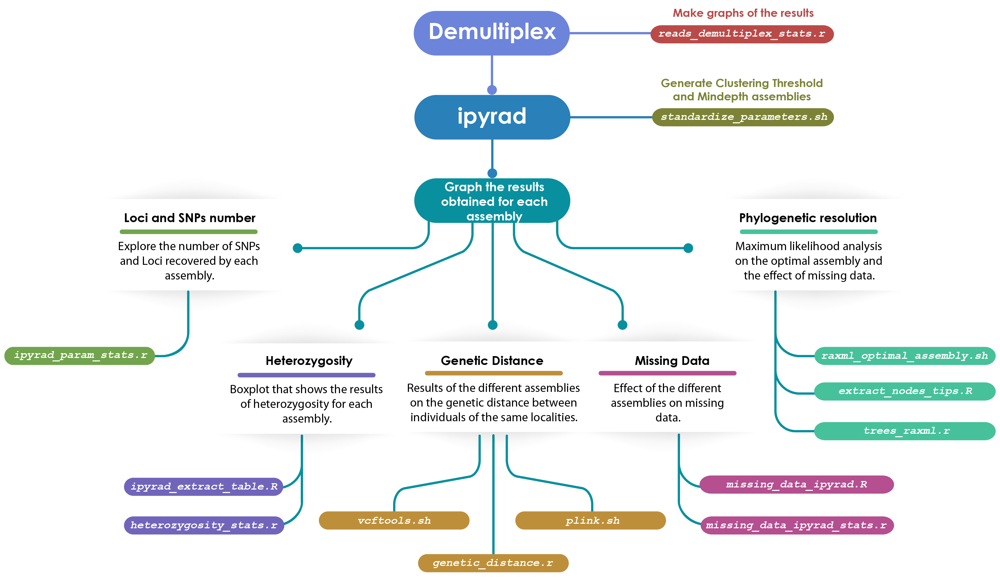

# Optimization of *de novo* assembly from GBS data
Genotyping by sequencing (GBS) is a method that has proven useful for resolving phylogenetic relationships in species complexes, as well as to evaluate population genetic structure. *ipyrad* was created by Eaton (2014) to assemble *de novo* loci or with reference genome to optimize coverage through phylogenetic data sets and it can work with GBS data. Because the level of genetic differentiation between samples depends on many factors, including population structure, effective size, and mutation rate, it is not advisable to perform analyzes with the default parameters. Since various metrics can be evaluated to find the optimal assemblies, the aims of this repository is to evaluate two parameters in ipyrad (clustering threshold and mindepth) under the evaluation of five metrics: the number of loci and SNPs recovered, the level of heterozygosis, the genetic distance between samples of the same locality and close to it, the fraction of lost data and bootstrap supports for maximum likelihood analysis. The resulting analyses will be evaluated to select the optimal assembly. The effect of lost data on phylogenetic resolution and support of nodes is also evaluated, as well as topology under different percentages of lost data.

### Workflow
**Demultiplexed**.- The first part of the analysis is demultiplexed the raw sequences, we tested three different software (*Stacks*, *ipyrad* and *GBSX*) to compare their performance. Subsequently, the results can be analyzed and plotted with the script `reads_demultiplex_stats.r`.

**ipyrad**.- To optimize the parameters clustering threshold and mindepth, we use el script `standardize_parameters.sh`

To **graph the results** obtained of the parameters optimization, we used the scripts marked i the figure 1 to each metric. To graph the results obtained from the parameters optimization, we used the scripts marked in figure 1 to each metric. When the *R* script finish in `.R` is a function that we will use in other script finish in `.r`. If the script finish in `.sh` we have to run in the *bash* terminal.

Figure 1.- Workflow to process GBS dataset

#### Prerequisites

##### Software:
- [GBSX v1.3](https://github.com/GenomicsCoreLeuven/GBSX)
- [ipyrad 0.7.30](https://ipyrad.readthedocs.io/index.html)
- [Stacks 2.3](http://catchenlab.life.illinois.edu/stacks/)
- [R 3.6.1](https://www.r-project.org/)
- [RAxML v8.2.11](https://cme.h-its.org/exelixis/web/software/raxml/)

##### R packages:
- ggplot2_3.2.0
- dplyr_0.8.0.3
- RColorBrewer_1.1-2
- reshape2_1.4.3
- treeio_1.8.2
- tidyr_0.8.3
- phylobase_0.8.6
- ggtree_1.16.6
- ape_5.3
- ggExtra_0.9
- phylotools_0.2.2
- seqRFLP_1.0.1  

##### PC info
- Running under: Ubuntu 18.04.2 LTS
- Motherboard: Asus TUF B450M-plus gaming
- CPU: Ryzen 7 2700x
- RAM: G.Skill Trident Z DDR4 4 x 8GB

#### Directories:
###### bin
Contains:
  * R function `.R`
    * `ipyrad_extract_table.R`.- extracts the tables of stats.txt file of ipyrad output folder.
    * `mean_bootstrap_raxml.R`.- calculates the bootstrap mean of RAxML_bipartitionsBranchLabels tree.
    * `extract_nodes_tips.R`.- extracts a list of nodes and its tip labels from a tree
    * `missing_data_ipyrad.R`.-  parse the .loci file and return a data frame with missing data for each loci

  * R script `.r`
    *  `reads_demultiplex_stats.r`.-  works to calculate the percentage of match reads and no match reads of the demultiplex process used stacks, ipyrad and gbsx.
    * `ipyrad_param_stats.r`.- works to analyze the results of the parameters tested in the process of standardized of ipyrad and creates the plots.  
    * `plot_mean_bootstrap.r`.- import all the trees created with raxml and extract the mean bootstrap value for each one. Also,  create a boxplot to compare the bostrap mean value between different parameters.
    * `heterozygosity_stats.r`.- works to analyze the results of the heterozygosity in the process of standardized of ipyrad and creates the boxplot.
    * `trees_raxml.r`.- import the trees obtained in raxml to modify them.
    * `genetic_distance.r`.- it generates the distance genetic from the plink raw file and it creates the boxplot.
    * `missing_data_ipyrad_stats.r`.- import the .loci files and extracts the number and percentage of missing data.

  * bash script `.sh`
    * `standardize_parameters.sh`.- works to run all the parameters selected to can standardize them.
    * `raxml_clust_tresh.sh`.- runs 10 times with different parsimony and bootstrap seeds for each clustering threshold parameter.
    * `vcftools.sh`.- Convert vcf files to plink files (.map and .ped).
    * `plink.sh`.- Generate .bed, .bim, .fam and .raw files

* note.- the folder `unused` contains the scripts that I use to practice and probe the final scripts

    * `ipyrad_read_loci.R`.- parse the .loci file into fasta file, and creates a table with the sequence length.

    * `compares_trees.r`.- compare the topology of two different trees

###### data

Contains the data demultiplex with GBSX:
 * the data are available in [OSF](https://osf.io).

###### meta
Contains information about the samples:
 * `Mamm_names.csv`.- is a table with the samples names and their identify key.
 * `Mamm_clades_chlor.csv`.- contains in the first column samples id, and the second column is to identify its position in the phylogeny with two chloroplast markers.

###### out
Contains the results of all analysis:
  * ###### demultiplex_stats
     + contains the results of demultiplex with GBSX, ipyrad and stacks. The reads number correctly assigned according to its barcode.
  * ###### ipyrad_outfiles
     + contains the results of parameter optimization in ipyrad.
  * ###### Rplots
     + It contains all the outputs resulting from the R analysis.
  * ###### tree_raxml
     + contains the trees resulting of RAxML analysis.

#### Notes

#### Credits
##### Cristian Cervantes
