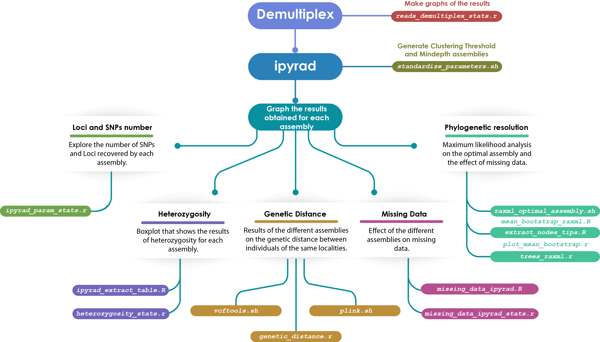

# Taxonomic delimitation of *Mammillaria haageana* (Cactaceae)

This repository contains a proposal of a workflow to process GBS data mainly with ipyrad (Fig. 1). I tested the performance of three different programs to demultiplex gbs data ([GBSX](https://github.com/GenomicsCoreLeuven/GBSX), [Stacks](http://catchenlab.life.illinois.edu/stacks/) and [ipyrad](https://ipyrad.readthedocs.io/index.html)). The filtering process was done in ipyrad. I made different assembled under different parameter settings, to find the optimal parameters for my dataset following the 80% rules ([Paris et al., 2017](https://besjournals.onlinelibrary.wiley.com/doi/10.1111/2041-210X.12775)).

Figure 1.- Workflow to process GBS dataset

#### Prerequisites

##### Software:
- [GBSX v1.3](https://github.com/GenomicsCoreLeuven/GBSX)
- [ipyrad 0.7.30](https://ipyrad.readthedocs.io/index.html)
- [Stacks 2.3](http://catchenlab.life.illinois.edu/stacks/)
- [R 3.6.1](https://www.r-project.org/)
- [RAxML v8.2.11](https://cme.h-its.org/exelixis/web/software/raxml/)

##### R packages:
- ggplot2_3.2.0
- dplyr_0.8.0.3
- RColorBrewer_1.1-2
- reshape2_1.4.3
- treeio_1.8.2
- tidyr_0.8.3
- phylobase_0.8.6
- ggtree_1.16.6
- ape_5.3
- ggExtra_0.9
- phylotools_0.2.2
- seqRFLP_1.0.1  

##### PC info
- Running under: Ubuntu 18.04.2 LTS
- Motherboard: Asus TUF B450M-plus gaming
- CPU: Ryzen 7 2700x
- RAM: G.Skill Trident Z DDR4 4 x 8GB

#### Directories:
###### bin
Contains:
  * R function `.R`
    * `ipyrad_extract_table.R`.- extracts the tables of stats.txt file of ipyrad output folder.
    * `mean_bootstrap_raxml.R`.- calculates the bootstrap mean of RAxML_bipartitionsBranchLabels tree.
    * `extract_nodes_tips.R`.- extracts a list of nodes and its tip labels from a tree
    * `missing_data_ipyrad.R`.-  parse the .loci file and return a data frame with missing data for each loci

  * R script `.r`
    *  `reads_demultiplex_stats.r`.-  works to calculate the percentage of match reads and no match reads of the demultiplex process used stacks, ipyrad and gbsx.
    * `ipyrad_param_stats.r`.- works to analyze the results of the parameters tested in the process of standardized of ipyrad and creates the plots.  
    * `plot_mean_bootstrap.r`.- import all the trees created with raxml and extract the mean bootstrap value for each one. Also,  create a boxplot to compare the bostrap mean value between different parameters.
    * `heterozygosity_stats.r`.- works to analyze the results of the heterozygosity in the process of standardized of ipyrad and creates the boxplot.
    * `trees_raxml.r`.- import the trees obtained in raxml to modify them.
    * `genetic_distance.r`.- it generates the distance genetic from the plink raw file and it creates the boxplot.
    * `missing_data_ipyrad_stats.r`.- import the .loci files and extracts the number and percentage of missing data.

  * bash script `.sh`
    * `standardize_parameters.sh`.- works to run all the parameters selected to can standardize them.
    * `raxml_clust_tresh.sh`.- runs 10 times with different parsimony and bootstrap seeds for each clustering threshold parameter.
    * `vcftools.sh`.- Convert vcf files to plink files (.map and .ped).
    * `plink.sh`.- Generate .bed, .bim, .fam and .raw files

* note.- the folder `unused` contains the scripts that I use to practice and probe the final scripts

    * `ipyrad_read_loci.R`.- parse the .loci file into fasta file, and creates a table with the sequence length.

    * `compares_trees.r`.- compare the topology of two different trees

###### data

Contains the data demultiplex with GBSX:
 * the data are available in [OSF](https://osf.io).

###### meta
Contains information about the samples:
 * `Mamm_names.csv`.- is a table with the samples names and their identify key.
 * `Mamm_clades_chlor.csv`.- contains in the first column samples id, and the second column is to identify its position in the phylogeny with two chloroplast markers.

###### out
Contains the results of all analysis:
  * ###### demultiplex_stats
     + contains the results of demultiplex with GBSX, ipyrad and stacks. The reads number correctly assigned according to its barcode.
  * ###### ipyrad_outfiles
     + contains the results of parameter optimization in ipyrad.
  * ###### Rplots
     + It contains all the outputs resulting from the R analysis.
  * ###### tree_raxml
     + contains the trees resulting of RAxML analysis.

#### Notes

#### Credits
##### Cristian Cervantes
