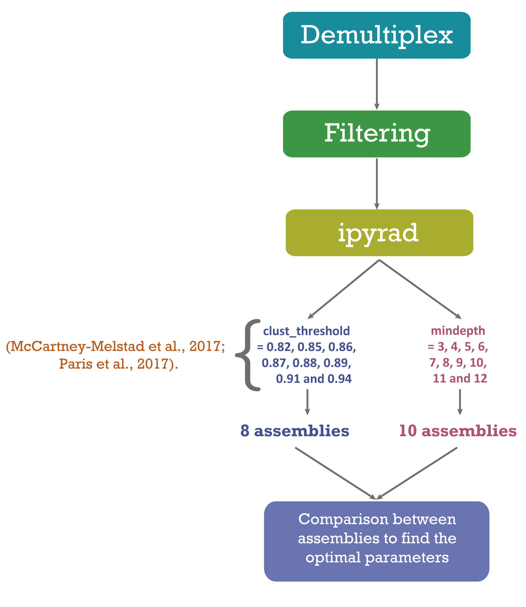
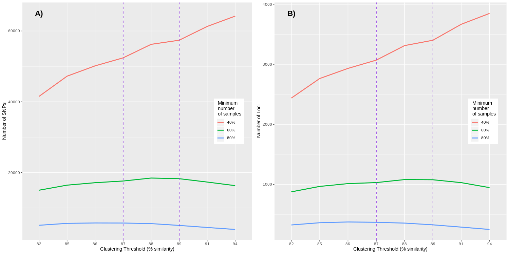
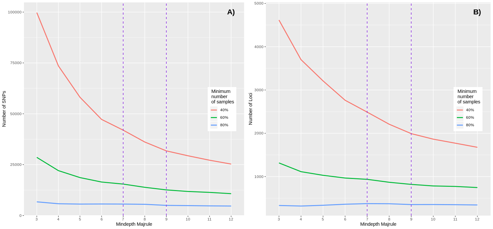
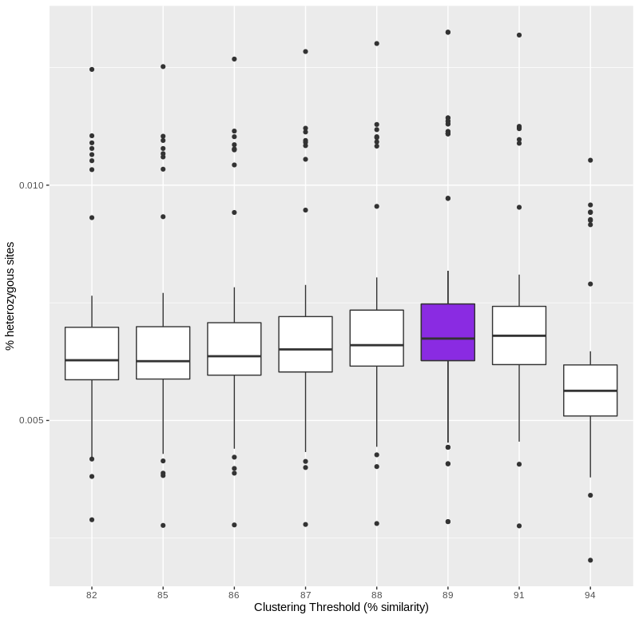

 ### Optimization of parameters in ipyrad.

Reduced genome representation techniques can be a useful tool in phylogenetic inference (Hou et al., 2015). Genotyping by sequencing (GBS) (Elshire et al., 2011), is a method that has proven useful for solving phylogenetic relationships in species complexes (Anderson, Thiele, Krauss, & Barrett, 2017), as well as to evaluate the structure genetics into populations (Otto et al., 2017). The main programs used to analyze the data obtained from GBS are stacks (Catchen et al., 2011) and ipyrad (Eaton, 2014). The difference between these two programs is that ipyrad uses a global alignment  algoritm through the USEARCH program (Edgar, 2010), which allows the presence of insertions and deletions (indels) making it possible to compare phylogenetically distant species (Pante et al., 2015).

Among the most important parameters in ipyrad is the minimum coverage, which refers to the number of readings needed to consider an allele or locus. This parameter allows us to distinguish between a PCR/sequencing error and real variation. If this value is very low we can accept variation from an error and consider it real, while if we choose a high value we can generate allele and locus drop (Fig. 1). If we generate locus drop our results will have a lot of lost data, but if we allow allele drop we are inflicting homozygosis when the real state of the locus is heterozygous (Mastretta-Yanes et al., 2015).

Figure 1.- Scheme showing the effects of using a low minimum coverage (= 2) and a high coverage (= 6), taken from Mastretta-Yanes et al. (2015)

The level of dissimilarity of the sequences is another parameter that is also important to take into account, since it allows us to distinguish paralogous loci. If we choose a very high value it will imply the risk of dividing the divergent alleles into separate loci when the orthologous differ by an amount greater than the similarity threshold, while lower similarity thresholds may allow the paralogous sequences to merge correctly into an orthologous site (Nadukkalam Ravindran et al., 2018). Improving the de novo assembly of data is important to obtain good results and reduce error rates (Mastretta-Yanes et al., 2015). In phylogenetic studies, it performs explorations of parameters that have been useful to find trees with highly resolved, and strongly supported topologies (Tripp et al., 2017).

Because the level of genetic differentiation among samples depends on many factors, including population structure, effective population size, and mutation rate, the default value shouldn't be expected to be accurate for all studies or species (McCartney-Melstad et al., 2017). There are two proposals to explore the parameters and choose the best assemble. Mastretta-Yanes el al. (2019), who chose the best assemble based on sequenced replicates, choosing parameter values that minimize the genetic distance among replicates. When replicate samples are not available, the option is to explore the parameters and choose those that maximize the number of recovered SNPs an loci (McCartney-Melstad et al., 2017; Paris et al., 2017).

Since we don't include replicates in our sequencing plate, the option is to follow the methods of McCartney-Melstad et al. (2017) and  Paris et al. (2017). Therefore, we evaluated eight assemblies of the clustering threshold and ten assembles of mindepth (Fig. 2). Finally, we compared the assemblies to find the optimal parameters.

Figure 2.- Workflow to process GBS dataset

  

Figure 3.- Workflow to process GBS dataset

  

Figure 4.- Workflow to process GBS dataset

  

Figure 4.- Workflow to process GBS dataset

  

Figure 4.- Workflow to process GBS dataset

